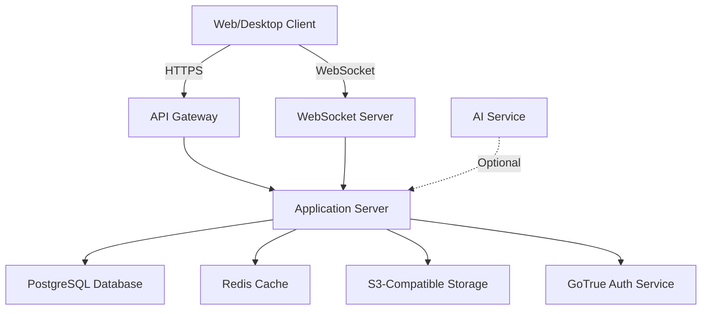

## Why Self-Host AppFlowy?

Self-hosting AppFlowy gives you complete control over your workspace data and infrastructure. Here are the key benefits:

<CardGroup cols={2}>
  <Card title="Data Sovereignty" icon="database">
    Keep all your workspace data on your own infrastructure with complete control over storage and access.
  </Card>
  <Card title="Privacy & Security" icon="shield-halved">
    Ensure sensitive information never leaves your network. Implement custom security policies.
  </Card>
  <Card title="Customization" icon="wrench">
    Customize the deployment to meet your specific requirements and integrate with existing systems.
  </Card>
  <Card title="Cost Control" icon="dollar-sign">
    Optimize costs by hosting on your own infrastructure without per-user subscription fees.
  </Card>
</CardGroup>

## Architecture Overview

AppFlowy's self-hosted architecture consists of several components working together:

### Core Components

<Card title="Application Server" icon="server">
  The main AppFlowy backend service that handles business logic, data processing, and real-time collaboration.
</Card>

<Card title="PostgreSQL Database" icon="database">
  Primary data store for workspaces, documents, users, and metadata. Requires version 14 or higher.
</Card>

<Card title="Redis Cache" icon="bolt">
  In-memory cache for session management, real-time presence, and performance optimization.
</Card>

<Card title="S3-Compatible Storage" icon="box">
  Object storage for file uploads, images, and document attachments. Works with AWS S3, MinIO, or similar.
</Card>

<Card title="GoTrue Authentication" icon="key">
  Authentication service managing user sign-up, login, and JWT token generation.
</Card>

## System Requirements

### Minimum Requirements

For small teams (up to 10 users):

<CardGroup cols={2}>
  <Card title="CPU" icon="microchip">
    2 vCPU cores
  </Card>
  <Card title="Memory" icon="memory">
    4 GB RAM
  </Card>
  <Card title="Storage" icon="hard-drive">
    20 GB SSD
  </Card>
  <Card title="Network" icon="network-wired">
    100 Mbps bandwidth
  </Card>
</CardGroup>

### Recommended Requirements

For medium teams (up to 100 users):

<CardGroup cols={2}>
  <Card title="CPU" icon="microchip">
    4-8 vCPU cores
  </Card>
  <Card title="Memory" icon="memory">
    16 GB RAM
  </Card>
  <Card title="Storage" icon="hard-drive">
    100 GB SSD (+ object storage)
  </Card>
  <Card title="Network" icon="network-wired">
    1 Gbps bandwidth
  </Card>
</CardGroup>

### Software Prerequisites

<Steps>
  <Step title="Operating System">
    Ubuntu 20.04 LTS or later, Debian 11+, or any modern Linux distribution with Docker support
  </Step>
  
  <Step title="Container Runtime">
    Docker Engine 24.0+ and Docker Compose 2.20+
  </Step>
  
  <Step title="Domain & SSL">
    A registered domain name and valid SSL certificate (or Let's Encrypt setup)
  </Step>
  
  <Step title="Network Access">
    Open ports: 80 (HTTP), 443 (HTTPS), and optionally 22 (SSH) for management
  </Step>
</Steps>

## Deployment Options

### Docker Compose (Recommended)

The simplest deployment method using Docker Compose to orchestrate all services. Best for:
- Small to medium teams
- Quick setup and testing
- Single-server deployments

### Kubernetes

Scalable deployment for production environments. Best for:
- Large organizations
- High availability requirements
- Multi-region deployments

### Manual Installation

Direct installation on bare metal or VMs. Best for:
- Custom infrastructure requirements
- Advanced users
- Specific compliance needs

## What's Next?

<CardGroup cols={2}>
  <Card title="Installation Guide" icon="download" href="/self-hosting/installation">
    Follow step-by-step instructions to deploy AppFlowy
  </Card>
  <Card title="Configuration" icon="gear" href="/self-hosting/configuration">
    Configure environment variables and services
  </Card>
  <Card title="Security Setup" icon="lock" href="/self-hosting/security">
    Secure your AppFlowy deployment
  </Card>
  <Card title="Community Support" icon="users" href="https://discord.gg/9Q2xaN37tV">
    Join our Discord for help and discussions
  </Card>
</CardGroup>

<Warning>
  Self-hosting requires technical expertise in system administration, Docker, and database management. Ensure you have the necessary skills or team support before proceeding.
</Warning>